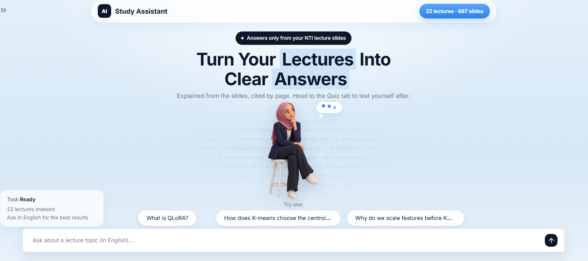
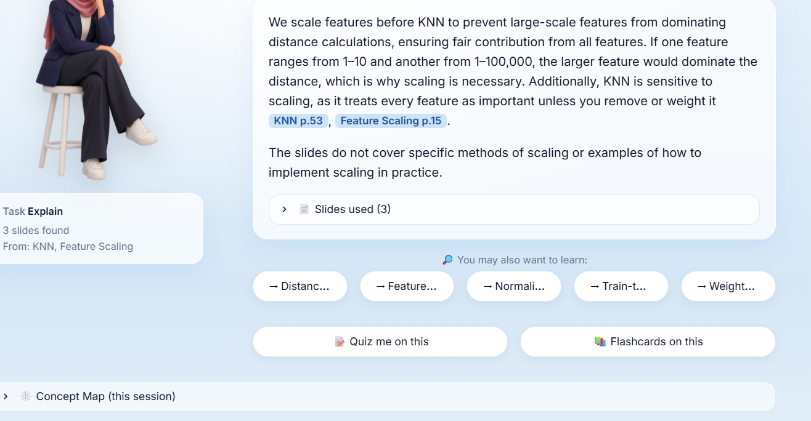
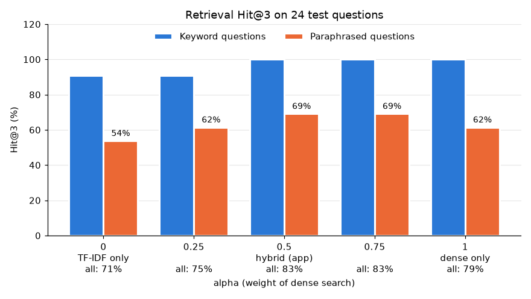
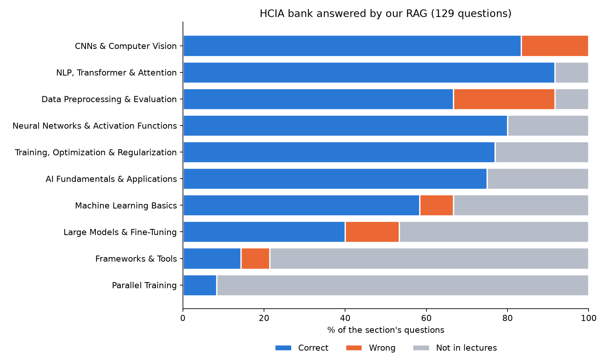

# HCIA-AI Study Assistant

A study assistant built on our NTI lecture slides.
Ask about any lecture topic and get an answer **only from our slides**, with the page it came from.
Then test yourself with an exam-style quiz, or revise with flashcards.

NTI AI graduation project · Kareem · Basmala · Youssif



---

## The problem

- The course has **24 PDFs (1,105 pages)**. Finding the slide that explains one idea means scrolling through hundreds of pages.
- ChatGPT answers from the internet, not from our lectures, and it can be wrong (hallucination).

## What the app does

A Streamlit app with 3 modes in the sidebar:

| Mode | What it does |
| --- | --- |
| 💡 **Explain Topic** | Finds the 3 closest slides and explains **only from them**, with citations like `[K-means p.21]`. Outside the lectures (e.g. "Who won the World Cup?") it answers *"I don't know based on the lectures."* |
| 📝 **Quiz** | 1–10 multiple-choice questions (3 by default) in the Huawei HCIA-AI exam style, written from the 5 closest slides. Single and "select all that apply" questions, graded all-or-nothing like the real exam. "New quiz on this topic" avoids repeated questions. |
| 📚 **Flashcards** | 1–30 key points (10 by default) from the 6 closest slides. Settings: difficulty, core vs core + supporting concepts, formulas, examples. Previous / Shuffle / Next. |

Under every answer:

- **You may also want to learn**: up to 5 related concepts, taken only from the same 3 slides. Click one to explain it.
- **Quiz me on this** / **Flashcards on this**: jump to the other pages with the same topic.
- **Concept Map**: every topic asked in the session and its related concepts, in one graph.

A topic that is not in the lectures gets no quiz and no flashcards.



---

## How it works (10 steps)

Steps 1–4 run **once** in the notebook. Steps 5–8 run **every time** the student asks, in the app.

| # | Step | What happens |
| --- | --- | --- |
| 1 | Data | NTI lecture PDFs (text read with `pypdf`) + an HCIA-AI question bank (Word → JSON with `python-docx` and regex) |
| 2 | EDA | Check how much text we can read from every PDF |
| 3 | Preprocessing | Clean the text, one slide = one chunk |
| 4 | Storage | Embeddings + TF-IDF, saved in ChromaDB |
| 5 | Retrieval | Hybrid search: meaning + words |
| 6 | Answer | RAG with `gpt-4o-mini` (temperature 0) + related concepts |
| 7 | Quiz | Slides = content, 3 closest bank questions = style (few-shot) |
| 8 | Flashcards | One key point per card, checked and de-duplicated |
| 9 | Evaluation | Hit@3 for retrieval, and the real exam bank end to end |
| 10 | App | Streamlit |

### Data and EDA decisions

- **24 PDFs, 1,105 pages.** Two files removed:
  - `gradient boosting regression _ example.pdf`: an exact copy (checked in code, page by page).
  - `Linear_Regression-1 2.pdf`: 79 pages of images, 0 characters of text (the text version is kept).
- 6 lectures have 19–40% screenshot pages with no readable text: a known limitation.
- Both decision tree files are kept: the small one has 11 new pages; the repeated pages are removed in step 3.
- Both removed files are in `excluded/`.

### Preprocessing

- `fix_spaced_letters`: pypdf sometimes splits words into letters (`Q U A N T I Z E D` → `QUANTIZED`).
- Skip pages with fewer than 30 characters (empty or title-only) and exact duplicate pages.
- **1,015 pages → 887 chunks** (100 empty, 28 duplicates removed).
- **One slide = one chunk.** We first tried agentic chunking (the LLM decides where a chunk ends): it lost the page numbers and needed one LLM call per paragraph. The experiment is in the notebook appendix (`agentic_chunks.json`).
- The lecture name is added at the start of every chunk (`[K-means]\n...`), because many slides never say their topic.
- The longest chunk is 370 tokens (average 96), under the 512-token limit of the embedding model, so no chunk is cut.

### Storage and retrieval

- Dense: `BAAI/bge-small-en-v1.5` (384 numbers per slide), cosine similarity, stored in ChromaDB (`rag_db/`).
- Sparse: `TfidfVectorizer(stop_words="english")`, 4,917 words, fit on the slides only (no data leakage: the question is only transformed).
- Both scores are min-max scaled to 0–1, then combined:

```
score = 0.5 × meaning + 0.5 × words
```

### Why RAG and not a fine-tuned model or an agent?

- RAG answers from our slides and can cite the page. No training needed.
- The flow is fixed (search → answer), so a simple pipeline is cheaper, faster and more predictable than an agent.

---

## Evaluation

### 1. Retrieval: Hit@3 (24 hand-labeled questions)

Is the right slide in the top 3?

| alpha (weight of meaning) | Hit@3 |
| --- | --- |
| 0 (words only) | 70.8% |
| 0.25 | 75.0% |
| **0.5 (used in the app)** | **83.3%** |
| 0.75 | 83.3% |
| 1 (meaning only) | 79.2% |



### 2. End to end: 129 real exam questions

The system answers each bank question from the lectures only, then we compare with the answer key (1 question excluded because the key itself was wrong).

- **66%** of the exam is covered by our lectures (85 / 129).
- **89%** correct when the lectures cover the question (76 / 85).
- Single choice 98% · multiple choice 62%.



---

## Setup

Tested on Windows with Python 3.11.

```bash
git clone https://github.com/karieem9/HCIA-AI-RAG-System.git
cd HCIA-AI-RAG-System
pip install -r requirements.txt
```

Create a file named `.env` next to `app.py`:

```
OPENAI_API_KEY=sk-...
```

Run the app:

```bash
python -m streamlit run app.py
```

The first start takes ~10 seconds (loading PyTorch and the embedding model; the model is downloaded once on the first run).

The notebook is **not** needed to run the app: `rag_db/` and `question_bank.json` are already in the repo.
Run `Study_Assistant_Pipeline.ipynb` only to rebuild the index or re-run the evaluations.

### Dependencies

See `requirements.txt`. Main ones: `streamlit`, `chromadb` (must stay on the pinned version: `rag_db/` was built with it), `sentence-transformers`, `torch`, `scikit-learn`, `langchain-openai`, `python-dotenv`. Notebook only: `pypdf`, `python-docx`, `pandas`, `matplotlib`.

### Note for the team: `rag_db/`

ChromaDB touches the files in `rag_db/` every time the app or the notebook opens it.

- Before `git pull`: close the app **and** the notebook kernel, then run `git restore rag_db`.
- Never commit `rag_db/` unless the index was rebuilt on purpose.

---

## Project structure

```
├── app.py                          Streamlit app (only reads rag_db/ and question_bank.json)
├── Study_Assistant_Pipeline.ipynb  EDA, preprocessing, indexing, evaluations
├── requirements.txt
├── rag_db/                         ChromaDB index (887 slides)
├── pages.json                      the 887 chunks
├── question_bank.json              130 exam questions (100 single, 30 multiple)
├── question_bank.docx / question_bank_answer_key.docx
├── bank_eval_results.json          results of evaluation 2
├── agentic_chunks.json             agentic chunking experiment (not used)
├── lectures/                       22 lecture PDFs
├── excluded/                       2 removed PDFs
├── assets/                         CSS, images, evaluation charts
└── .streamlit/config.toml
```

---

## Limitations and future work

| Limitation | Future work |
| --- | --- |
| Text inside screenshots is not read | A vision model to read the images |
| English questions only (`bge-small-en`) | A multilingual embedding model for Arabic |
| Small retrieval test set (24 questions) | More labeled test questions |
| Multiple choice is harder (62%): the 3 slides often mention only some correct options | Send more slides to the LLM |
| Some exam topics are not in our lectures (e.g. Parallel Training, Frameworks & Tools) | Add more study sources |
| The "not in the lectures" decision comes from the prompt, not a score threshold | A retrieval score threshold |
